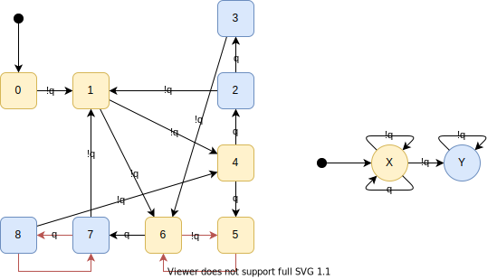
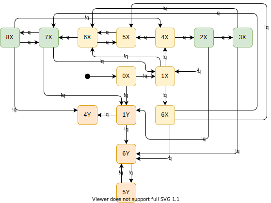
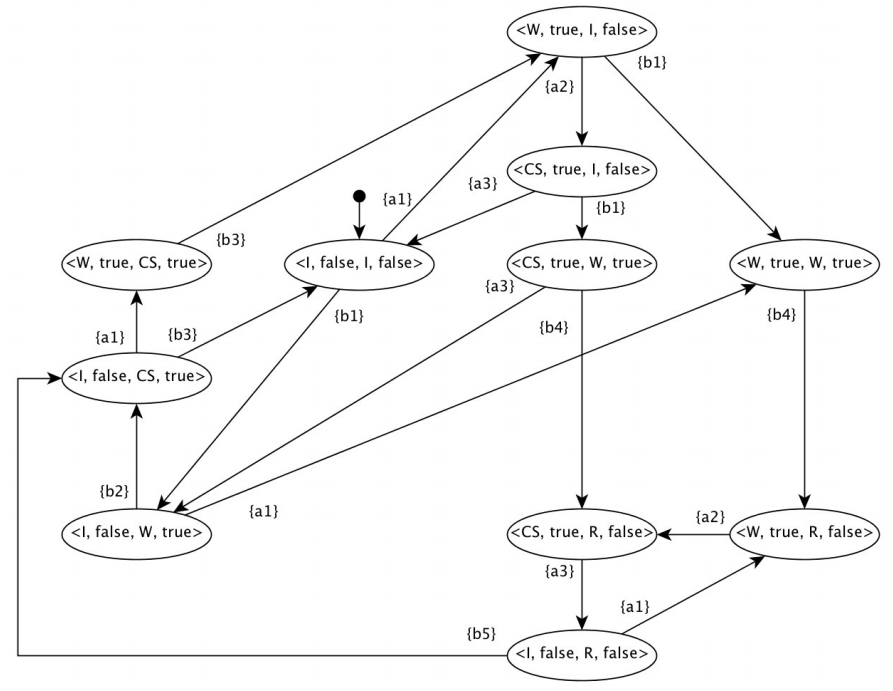
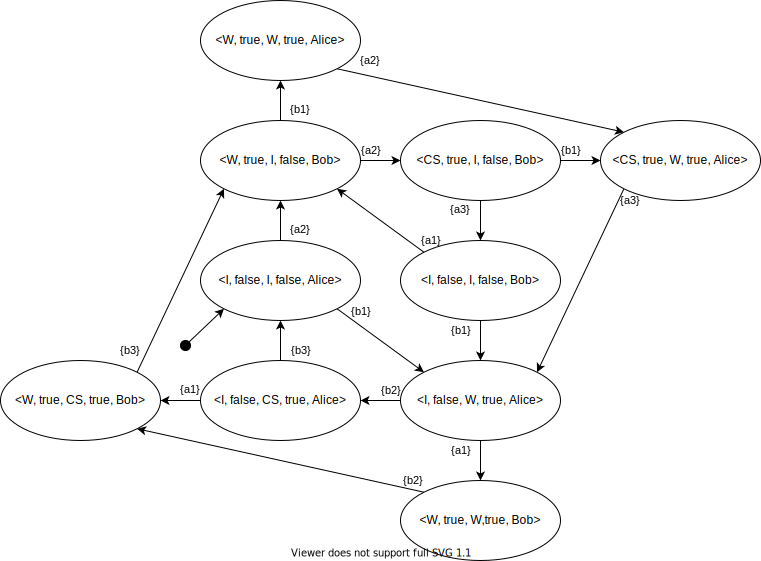

# Vérification Formelle TD Alice & Bob

<table><tbody><tr><td>JÉZÉGOU</td><td>Pierre-Yves</td><td>FIPA 2021</td></tr></tbody></table>

# Exercice 11

on fait le produit synchrone des automates suivants:

on obtiens l'automate suivant:

Selon l'automates aucun mot permet d'obtenir un état accepter (2Y, 3Y, 7Y, 8Y), le langage est donc vide

# Exercice 12

Prenons un ꞷ mots possible mais non accepté: "!q!q(!w!w)ꞷ". cet ꞷ mot nous permet atteindre l'état **6Y** qui met un seul des deux automates dans un état final, les états successif sont:

- 0X
- 1X
- 6Y
- ***5Y***
- ***6Y***
-  ***...***
- ***5Y***
- ***6Y***

Avec ces succession de **q!** successives personne atteins la section critique, et donc personne ne sort son chien/chat car Bob ne fait que monté/descendre sont drapeaux et Alice et donc coincé dans son vestibule, sans jamais pouvoir sortir chien

# Exercice 13

On voit que Alice  pourrait boucler a l'infini sans laisser Bob sortir son chat :

- <I, false, I, false>; {a1}
- <W, true, I, false>; {a2}
- <CS, true, I, false>; {a3}
- <I, false, I, false>; {a1}
- ...

Ici c'est bob qui reste coincé dans son vestibule avec son chat 

# Exercice 14

On voit ici que dans les états

<CS, true, R, false>;<W, true, R, false>;<I, false, R, false> générer par la transitons {b4} on se trouve alors dans un états ou Alice peut bouclé sans laissé a bob l'occasion de sortir son chien, la où Bob n'a pas de transition lui permettant de bouclé sur la sortie de son chat sans laisser a Alice l'occasion de le faire, comme Bob et Alice ne peuvent pas tout les deux atteindre un état interdisant a l'autre la sortie de son animal il n'y a pas Equité 

# Exercice 15

- P1 Il n’existe pas d’état avec  
- P2 Tous les états ont une flèche pour sortir (donc transition sortante) 
- P3 Il n’est pas possible de revenir à l’état initial (rebouler) sans être passé par un état CS 
- P4 Si un état  est actif, il est obligé de repasse par un état  avant de retrouver (état initial).